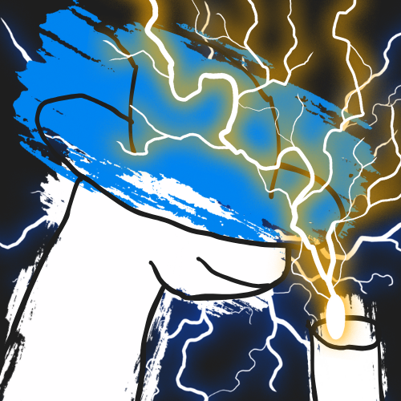

# GameMaster
> Slack bot of games, master of all. A multiplayer game bot made for Slack, powered by Python.


*The GameMaster logo: Wizard Orpheus casting lightning.*

## Features
- Runs on lightweight Python
- 2 games in 1 (more coming!)
- Multiplayer - any user can join in

## Games
This Slack bot is a WIP - many more games are coming!
- **Wordle**: known and loved. Guess the word with colour clues. 
    - Next steps: customise the emojis that appear as emoji clues.
- **Weather Hopper**: guess the current temperature in cities around the world.
    - Next steps: have the bot pick a city automatically and detect which city it is.
- **More coming soon!**

## Hosting Instructions
To host GameMaster locally or on a server, follow these steps:
1. **Clone the repository**
    ```bash
    git clone https://github.com/your-username/game-master.git
    cd game-master
    ```
2. **Set up a Python environment**
    ```bash
    python -m venv venv
    source venv/bin/activate  # On Windows: venv\Scripts\activate
    ```
3. **Install dependencies**
    ```bash
    pip install -r requirements.txt
    ```
4. **Configure environment variables**
    Create a `.env` file in the project root with your Slack bot credentials:
    ```
    SLACK_BOT_TOKEN=your-slack-bot-token
    SLACK_SIGNING_SECRET=your-slack-signing-secret
    ```
5. **Run the bot**
    ```bash
    python main.py
    ```
6. **Add the bot to your Slack workspace**

    - Go to your Slack app settings and install the bot to your workspace.
    - Invite the bot to a channel using `/invite @GameMaster`.

GameMaster should be running and ready to play!

## Story
This is my first ever Slack bot - I've always seen them used but I've never had the skills to make one. This is my first crack at it and I definitely know that it could do with some work... But this experience has taught me the fundamentals of Slack Bolt, and one day maybe this could be the springboard to something even better! After fighting with Nest for a while I've learned how to work with it. The journey has been long, hard and beautiful. Thanks for your support!

## Contributing
Contributions are welcome and very much appreciated!

1. Fork the repo and branch.
2. Make your changes.
3. Open a pull request.

Feel free to open issues for bugs or suggestions! 

*made with ❤️ by [@isobel-p](https://github.com/isobel-p)*